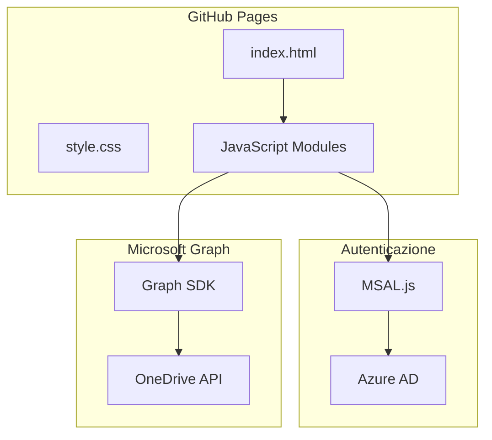

# Walkthrough: OneDrive Upload Interface

## 🎯 Obiettivo Completato

Creata un'interfaccia web moderna per caricare foto e video su OneDrive condiviso.

## 📁 File Creati

| File                                                                                                            | Descrizione                     |
| --------------------------------------------------------------------------------------------------------------- | ------------------------------- |
| [index.html](file:///Users/nicco/Antigravity%20Projects/cmpgvng/index.html)                                     | Pagina principale               |
| [css/style.css](file:///Users/nicco/Antigravity%20Projects/cmpgvng/css/style.css)                               | Stili dark mode + glassmorphism |
| [js/config.js](file:///Users/nicco/Antigravity%20Projects/cmpgvng/js/config.js)                                 | Configurazione Azure AD         |
| [js/auth.js](file:///Users/nicco/Antigravity%20Projects/cmpgvng/js/auth.js)                                     | Autenticazione MSAL.js          |
| [js/upload.js](file:///Users/nicco/Antigravity%20Projects/cmpgvng/js/upload.js)                                 | Upload file (piccoli e grandi)  |
| [js/ui.js](file:///Users/nicco/Antigravity%20Projects/cmpgvng/js/ui.js)                                         | Gestione UI e drag-drop         |
| [js/app.js](file:///Users/nicco/Antigravity%20Projects/cmpgvng/js/app.js)                                       | Entry point                     |
| [README.md](file:///Users/nicco/Antigravity%20Projects/cmpgvng/README.md)                                       | Documentazione                  |
| [.github/workflows/deploy.yml](file:///Users/nicco/Antigravity%20Projects/cmpgvng/.github/workflows/deploy.yml) | Deploy automatico               |

## 🏗️ Architettura



## ✅ Funzionalità Implementate

1. **Autenticazione OAuth2 + PKCE**

   - Login popup con Microsoft
   - Gestione token automatica
   - Logout sicuro

2. **Upload File**

   - File piccoli (< 4MB): upload diretto
   - File grandi (> 4MB): upload resumable
   - Limite configurabile (default 500MB)

3. **UI/UX**
   - Dark mode moderno
   - Glassmorphism
   - Drag & drop
   - Preview immagini
   - Progress bar animata
   - Toast notifications
   - Responsive mobile

## 🔧 Passi Mancanti (da fare manualmente)

### 1. Registrazione Azure AD

1. Vai su [portal.azure.com](https://portal.azure.com)
2. Cerca "App registrations" → "New registration"
3. Nome: "I Nostri Momenti"
4. Account types: "Any org + personal"
5. Redirect URI: SPA → `https://USERNAME.github.io/REPO`
6. Copia **Application (client) ID**

### 2. Configura Permessi API

1. Vai in "API permissions"
2. Aggiungi:
   - `User.Read`
   - `Files.ReadWrite.All`

### 3. Aggiorna config.js

```javascript
clientId: 'IL-TUO-CLIENT-ID',
folderPath: '/NomeCartella',
```

### 4. Deploy su GitHub

```bash
git init
git add .
git commit -m "feat: initial upload interface"
git remote add origin https://github.com/TUO-USER/TUO-REPO.git
git push -u origin main
```

### 5. Abilita GitHub Pages

Settings → Pages → Source: GitHub Actions

## 🧪 Test Locale

Server attivo su: **http://localhost:3000**

> [!NOTE]
> Il login non funzionerà in locale finché non configuri Azure AD con il Client ID corretto e aggiungi `http://localhost:3000` come redirect URI di test.
